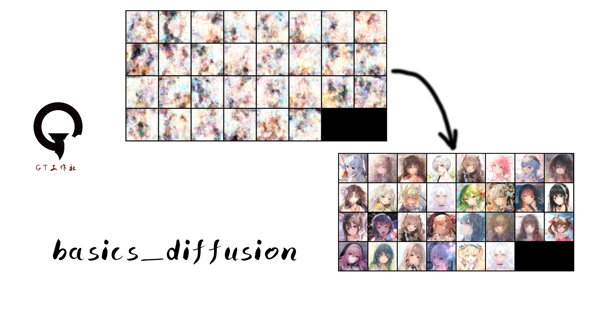

# basics_diffusion

轻量化的diffusion模型。 Lightweight diffusion model.



## Installation

Install project

```bash
conda create -n diffusion python 3.x
conda activate diffusion
cd basics_diffusion
pip install -r requirements.txt
```
    
## Train
Enter the config file and modify it.进入config文件下进行修改。
```bash
Num_epochs = 50000                               训练次数。Training times.
Image_size = 64                                  输入或生成图片大小。Enter or generate picture size.
Dataset_root = "F:/datasets/anime_1024x1024_tiny/images"               数据集地址，文件夹包含图片。Data set address, subfolder containing pictures.                       
Batch_size = 30                                  数据集的训练批次。Training batch of data set.
Noise_timesteps = 1000                           生成噪声的步数，越短训练越快。The shorter the steps to generate noise, the faster the training.
Weights_path = "weights/model_64x64.pth"         设置权重生成的地址和名称。Set the address and name of the weight generation.
Learning_rate = 5e-5                             学习率。
```
配置完config.py文件，再执行文件train.py。 After configuring the config.py file, execute the file .
```bash
python train.py
```
## Test
Under the test() function, num_ IMG is to select and generate several pictures.在test()函数下，num_img是选择生成几张图片。
```bash
python test.py
```

